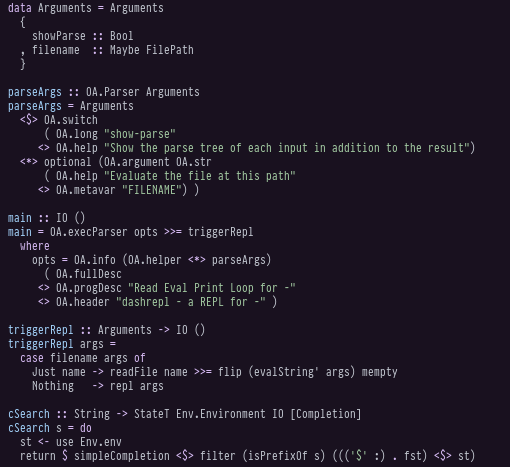
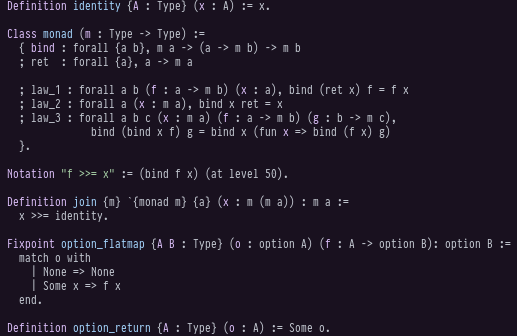
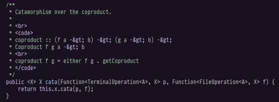

# haskell-lang-theme

This is a port of the theme of the code snippet in the header of
https://www.haskell.org/ to Emacs.

It's not an exact port, but that is the inspiration of this theme.

Please send patches to make this prettier. :)

# Screenshots

# License

GPLv2+.
